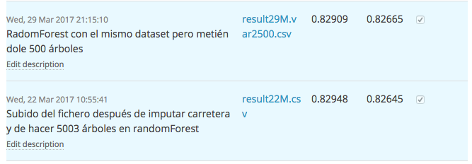
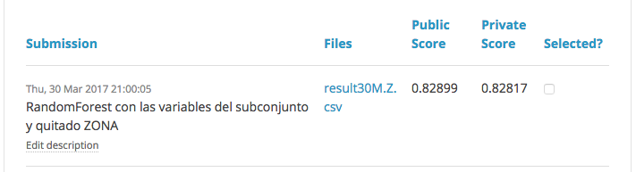

```{r setup, include=FALSE}
knitr::opts_chunk$set(echo = TRUE)

# Librerías que se van necesitando
library(ggplot2)
library(Hmisc)
library(mice)
library(VIM)
library(FSelector)
library(mlbench)
library(lattice)
library(caret)
library(e1071)
library(randomForest)
library(NoiseFiltersR)
library(Rlof)
library(plyr)
library(dplyr)
library(pROC)

# Cargando el Environment
load("myData.RData")

# Exportación del dataset
# accident.train <- read.csv2("./datos/accidentes-kaggle.csv",sep = ",", header = T)
# accident.test <- read.csv2("./datos/accidentes-kaggle-test.csv", sep = ",", header = T)
# accident.test$TIPO_ACCIDENTE <- NA
# full.data <- rbind(accident.train, accident.test)
```

\newpage
\tableofcontents
\listoffigures
\newpage

## Introducción

Esta práctica corresponde a la asignatura *Minería de datos: preprocesamiento y clasificación* perteneciente al *Máster en Ciencia de Datos e Ingeniería de computadores* de la *Universidad de Granada*. Y servirá para la calificación de la asignatura.

En esta práctica se usarán los métodos de preprocesamiento y aprendizaje vistos en la asignatura, para ello se hará uso de la plataforma Kaggle, que permite establecer una competición entre todos los alumnos.

Para dicha competición se analizará un dataset con información sobre accidentes de tráfico, donde el objetivo es clasisificar a partir de las variables dadas de que tipo de accidente se trata.

El mi caso el usuario utilizado para la competición kaggle ha sido *Adrián*. Quedando finalmente en el puesto número 23 con una puntuación de 0.82665.

En este informe se detallará el código realizado para la subida a kaggle con más puntuación privada 0.82817, que me hubiera colocado en la octava posición y la entrada al kaggle con mayor puntuación obtenida de las 5 entradas que había que seleccionar.

El código completo se puede ver en la siguiente dirección: https://github.com/AdCalzadilla/preproceamientoclasificacion.

## Estructura del dataset

El conjunto de datos a analizar corresponde a una muestra de 30.002 instancias de accidentes que se han producido en España durante los años del 2008 al 2013. Además se cuenta con un conjunto de test de 19998 instancias donde se realizarán las predicciones.

El dataset está formada por 31 variables, siendo la variable de salida *"TIPO_ACCIDENTE"*. Las otras variables, predictoras, que componen al dataset son las siguientes:

* ANIO
* MES
* HORA
* DIASEMANA
* PROVINCIA
* COMUNIDAD_AUTONOMA
* ISLA
* TOT_VICTIMAS
* TOT_MUERTOS
* TOT_HERIDOS
* TOT_VEHICULOSIMPLICADOS
* ZONA
* ZONA_AGRUPADA
* RED_CARRETERA
* CARRETERA
* TIPO_VIA
* TRAZADO_NO_INTERSEC
* TIPO_INTERSEC
* ACOND_CALZADA
* PRIORIDAD
* SUPERFICE_CALZADA
* LUMINOSIDAD
* FACTORES_ATMOSFERICOS
* VISIBILIDAD_RESTRINGIDA
* OTRA_CIRCUNSTANCIA
* ACERAS
* DENSIDAD_CIRCULACION
* MEDIDAS_ESPECIALES

### Descripción de las variables

#### ANIO

Año en el que se produce el accidente.

```{r}
describe(accident.train$ANIO)
```

#### MES

Mes en el que se produce el accidente.

```{r}
describe(accident.train$MES)
```

#### HORA

Hora a la que se produce el accidente.

```{r}
describe(accident.train$HORA)
```

#### DIASEMANA

Día de la semana en el que se produce el accidente.

```{r}
describe(accident.train$DIASEMANA)
```

#### PROVINCIA

Provincia en la que se produce el accidente.

```{r}
describe(accident.train$PROVINCIA)
```

#### COMUNIDAD_AUTONOMA

Comunidad Autónoma en la que se produce el accidente.

```{r}
describe(accident.train$COMUNIDAD_AUTONOMA)
```

#### ISLA

Indica si es una isla o no, y si es dice cual.

```{r}
describe(accident.train$ISLA)
```

#### TOT_VICTIMAS

Número total de víctimas.

```{r}
describe(accident.train$TOT_VICTIMAS)
```

#### TOT_MUERTOS

Número total de muertos que hubo en el accidente.

```{r}
describe(accident.train$TOT_MUERTOS)
```

#### TOT_HERIDOS_GRAVES

Número de heridos catalogados como graves.

```{r}
describe(accident.train$TOT_HERIDOS_GRAVES)
```

#### TOT_HERIDOS_LEVES

Número de heridos etiquetados con categoría leve.

```{r}
describe(accident.train$TOT_HERIDOS_LEVES)
```

#### TOT_VEHICULOS_IMPLICADOS

Número total de vehículos implicados en el accidente.

```{r}
describe(accident.train$TOT_VEHICULOS_IMPLICADOS)
```

#### ZONA_AGRUPADA

Agrupa la localización del accidente en Vías interurbanas o urbanas.

```{r}
describe(accident.train$ZONA_AGRUPADA)
```

#### RED_CARRETERA

Responsable de la carretera en la que se produzco el accidente.

```{r}
describe(accident.train$RED_CARRETERA)
```

#### TIPO_VIA

Tipo de vía en la que se produzco el accidente

```{r}
describe(accident.train$TIPO_VIA)
```


#### TIPO_INTERSEC

Describe si es una intersección el tipo de intersección donde se produjo el accidente.

```{r}
describe(accident.train$TIPO_INTERSEC)
```

#### ACOND_CALZADA

Refleja que tipo de calzada es.

```{r}
describe(accident.train$ACOND_CALZADA)
```

#### PRIORIDAD

Normativa que se aplica al lugar donde se produjo el accidente.

```{r}
describe(accident.train$PRIORIDAD)
```

#### SUPERFICIE_CALZADA

Estado de la calzada en el momento del accidente.

```{r}
describe(accident.train$SUPERFICIE_CALZADA)
```

#### LUMINOSIDAD

Luminosidad que había en el momento del accidente.

```{r}
describe(accident.train$LUMINOSIDAD)
```

#### FACTORES_ATMOSFERICOS

Descripción meteorológica en el momento del accidente.

```{r}
describe(accident.train$FACTORES_ATMOSFERICOS)
```

#### VISIBILIDAD_RESTRINGIDA

Describe si hubo algún condicionante que redujo la visibilidad en el momento del accidente.

```{r}
describe(accident.train$VISIBILIDAD_RESTRINGIDA)
```

#### OTRA_CIRCUNSTANCIA


```{r}
describe(accident.train$OTRA_CIRCUNSTANCIA)
```

#### ACERAS

Refleja si la vía en la que se produjo el accidente tiene acera o no.

```{r}
describe(accident.train$ACERAS)
```

#### DENSIDAD_CIRCULACION

```{r}
describe(accident.train$DENSIDAD_CIRCULACION)
```

#### MEDIDAS_ESPECIALES

Describe si se ha tomado alguna medida adicional a la hora del accidente.

```{r}
describe(accident.train$MEDIDAS_ESPECIALES)
```

### Análisis de la variable de salida

El objetivo de la práctica es clasificar los accidentes según las clases que ofrece esta variable. Para ello se ha dispuesto a realizar un análisis más detallado de esta variable. En la *Figura \ref{fig:plotVarAccidente}* se puede observar como están repartidas las instancias entre las diferentes clases.

```{r echo= FALSE, fig.cap="Instancias clasificadas según TIPO_ACCIDENTE\\label{fig:plotVarAccidente}"}
plot(accident.train$TIPO_ACCIDENTE)
```

```{r}
describe(accident.train$TIPO_ACCIDENTE)
```

Al analizar la variable se puede observar claramente que existe un desbalanceo entre las clases siendo la mayoritaria *Colisión de Vehículos* con el 55% de los casos estudiados. Le siguen las clases: *Salida Vía* con el 20% y *Atropello* con el 12%. Las demás tienen un porcentaje inferior al 7%.

### Análisis preliminar de los datos

Después de realizar un análisis variable por variable se ha decidido eliminar las variables:

* *CARRETERA*, demasiados NAs.
* *ACOND_CALZADA*, demasiados NAs.
* *TOT_VICTIMAS*, porque es la suma de las variables: *TOT_MUERTOS*, *TOT_HERIDOS_LEVES* y *TOT_HERIDOS_GRAVES*.

```{r}
# Se elimina la variable CARRETERA
full.data$CARRETERA <- NULL
# Se elimina la variable ACOND_CALZADA
full.data$ACOND_CALZADA <- NULL
# Se elimina la variable TOT_VICTIMAS
full.data$TOT_VICTIMAS <- NULL
```

## Imputación de valores

Un problema común en los datos suele ser la existencia de valores perdidos. El tratamiento de estos datos se puede tratar desde distintas aproximaciones:

* Usar algunas técnicas de aprendizaje. Por ejemplo, los métodos de clasificación basados en árbol.
* Eliminar instancias que contengan muchos valores perdidos.
* Asignar valores utilizando imputación.

Esta última es la que se va a aplicar en el dataset. Para ello se utilizará el paquete *mice*,que proporciona una implementación del algoritmo *MICE* tal como se describe en Van Buuren y Groothuis-Oudshoorn (2011). Para su ejecución se usarán los siguientes parámetros:

* method = pmm
* m = 10
* maxit = 5

La imputación se hará en dos fases. La primera se aplicará el algoritmo al dataset de "train" y en la segunda parte se realizará al dataset completo.

```{r eval=FALSE, echo=TRUE}
## --- > MICE < --- ##
set.seed(179385)
# Intentar train primero y después juntar el test y volver hacer la imputación
full.train <- full.data[1:30002,]
full.test <- full.data[30003:nrow(full.data),]

#se realiza la imputacion (m = 10)
imputados <-  mice::mice(full.train, m=10, method="pmm", maxit = 5)
# se completa el conjunto de datos con las imputaciones
datosImputados <-  mice::complete(imputados)

# Pasamos a full.data el nuvo data.frame con todos los datos imputados
full.train <- datosImputados
full.data <- rbind(full.train, full.test)

################################################################################################
# Volvemos a realizar la imputación, pero esta vez a todo el conjunto quitando la variable clase
# perdidos.

#se realiza la imputacion (m = 10)
imputados <-  mice::mice(full.data[,-27], m=10, method="pmm", maxit = 5)
# se completa el conjunto de datos con las imputaciones
datosImputados <-  mice::complete(imputados)

full.data[,1:28] <- datosImputados
```

## Selección de características

Una vez se han imputado los valores perdidos el siguiente paso es la selección de las variables adecuadas para que resulte el mejor modelo posible.

### Selección de varaibles utilizando Random Forest

Método de cálculo de importancia de atributos calculados sobre un modelo usando el algoritmo Random Forest, combinación de árboles predictores tal que cada árbol depende de los valores de un vector aleatorio probado independientemente y con la misma distribución para cada uno de estos. Los nodos del modelo se analizan para aportar información de importancia de cada variable. Además indica que variables utilizar para conseguir el mejor modelo.

```{r eval=FALSE, echo= TRUE}
# Sacado del fichero caret-randomForest.R
set.seed(74749572)
# define el control usando la funcion de seleccion mediante random forest
control <- caret::rfeControl(functions=rfFuncs, method="cv", number=10)
# ejecuta el metodo
results <- caret::rfe(trainData[,1:26], trainData[,27], sizes=c(1:26), rfeControl=control)
```

A continuación se muestran los resultados obtenidos:

```{r}
# muestra los resultados
print(results)
# muestra las caracteristicas elegidas
conjVariables <- predictors(results)
```

En la *Figura \ref{fig:plotVar}* se muestra el número de variables que el algoritmo ha considerado como las mejores para realizar el ajuste.

```{r echo= FALSE, fig.cap="Gráfica donde se muestra el número de variables adecuadas para el ajuste\\label{fig:plotVar}"}
# realiza un grafico de los resultados.
plot(results, type=c("g", "o"), lw=2)
```

### Variables Correladas

En primer lugar se mira la correlación entre las variables predictoras y la salida. Para ello se ha creado una función, *filterMethods* que devuelve una matriz con diferentes medidas de correlación para variables categóricas.

```{r}
## Crear la matriz y el caluculo de los estadísticos a partir de una función
filterMethods <- function(vs, df){
  w.chi.squared <- FSelector::chi.squared(vs~., df)
  w.gain.ratio <-  gain.ratio(vs~., df)
  w.information.gain <- FSelector::information.gain(vs~., df)
  w.symetrical <-  symmetrical.uncertainty(vs~., df)
  w.oneR <- FSelector::oneR(vs~., df)

  mat <- as.matrix(w.chi.squared)
  mat <- cbind(mat, w.gain.ratio)
  mat <- cbind(mat, w.information.gain)
  mat <- cbind(mat, w.symetrical)
  mat <- cbind(mat, w.oneR)
  names(mat) <- c("chi.squared", "gain.ratio", "information.gain", "symetrical", "oneR")
  return(mat)
}

###### ------------ CORRELACIÓN PARA SELECCIONAR VARIABLES ------------------
matrix.all.result <- filterMethods(accident.train$TIPO_ACCIDENTE, accident.train)
head(matrix.all.result)
```

Para la selección de características de todas las medidas de correlación se ha utilizado *chi cuadrado*.

A continuación se mide la correlación entre variables mediante la función *compareItems* y *correlationExit*:

```{r}
## Función para comparar la correlación existente entre dos variables
compareItems <- function(x, y){
  mat <- matrix(data = c(matrix.all.result[x,], matrix.all.result[y,]),
                nrow = 2,
                byrow = T,
                dimnames = list(c(x, y), names(matrix.all.result)))
}

## Función para calcular la correlación entre dos variables
correlationExit <- function(value, vs, dataset){
  w.chi <- FSelector::chi.squared(vs~value,dataset)
  w.gain <- FSelector::gain.ratio(vs~value,dataset)
  w.information <- FSelector::information.gain(vs~value,dataset)
  w.symetrical <- FSelector::symmetrical.uncertainty(vs~value,dataset)
  x <- c(w.chi, w.gain, w.information, w.symetrical)
  names(x) <- c("chi.squared", "gain.ratio", "information.gain", "symetrical")
  return(x)
}
```

Se aplica esta función a cada una de las variables. En el siguiente fragmento de código sólo se muestran algunos ejemplos.

```{r}
###### ------------ CORRELACIÓN PARA QUITAR VARIABLES ------------------
# ZONA ~ ZONA_AGRUPADA
w.ZONA <- correlationExit(accident.train$ZONA_AGRUPADA, accident.train$ZONA, accident.train)
w.ZONA

# TRAZADO_NO_INTERSEC ~ TIPO_INTERSEC
w.INTERSEC <- correlationExit(accident.train$TRAZADO_NO_INTERSEC, accident.train$TIPO_INTERSEC, accident.train)
w.INTERSEC

##RELACION INTERSECION PROVINCIA/COMUNIDAD AUTONOMA
w.PROVINCIA.COM <- correlationExit(accident.train$PROVINCIA, accident.train$COMUNIDAD_AUTONOMA)
w.PROVINCIA.COM
# PROVINCIA ~ COMUNIDAD_AUTONOMA
comparePyC <- compareItems("PROVINCIA", "COMUNIDAD_AUTONOMA")
comparePyC
```

#### Transformación a algunas variables

Además de calcular la correlación entre variables y la importancia de estas respecto a la salida, también se han realizado cambios en variables como la *HORA*. En este caso se discretiza la variable.

```{r}
# Pasamos la hora a entero
full.data$HORA <- trunc(full.data$HORA)
```

El siguiente paso es la construcción de modelos teniendo en cuenta los resultados obtenidos a partir de los calculos de correlación y de importancia de las variables realizado.

## Modelos

Para realizar los modelos se ha utilizado el conjunto de entrenamiento y de ahí se ha seleccionado el conjunto de variables que se ha obtenido en el puto anterior.

```{r}
sub.full.data <- full.data[,conjVariables]
sub.full.data$TIPO_ACCIDENTE <- full.data$TIPO_ACCIDENTE
trainData <- sub.full.data[1:30002,]
```

Después de probar con varios algoritmos el que mejor resultados da es el algoritmo *Random Forest*. Una vez seleccionado el algoritmo se construyen varios modelos alternando variables dependiendo de los cálculos realizados anteriormente.

El primero modelo es con todas las varaibles seleccionadas:

```{r eval= FALSE, echo= TRUE}
# ***** Random Forest *****
rf.model.29M.var <- randomForest::randomForest(TIPO_ACCIDENTE ~ ., data=trainData, ntree=500)
```

Se muestran los resultados obtenidos para el modelo *rf.model.29M.var*.

```{r}
print(rf.model.29M.var)
rf.importancia.29M.var <- randomForest::importance(rf.model.29M.var)
rf.importancia.29M.var
```

En la *Figura \ref{fig:plotModel29Var}* se muestra ordenadamante la importancia de las variables para la producción del modelo.

```{r echo= FALSE, fig.cap="Importancia de las variables para el modelo rf.model.29M.var\\label{fig:plotModel29Var}"}
varImpPlot(rf.model.29M.var)
```

El siguiente modelo realizado es quitar al dataset una de las variables más correladas entre ellas, en este caso *ZONA*:

```{r eval= FALSE, echo= TRUE}
# ***** Random Forest *****
rf.model.30M.Z <- randomForest::randomForest(TIPO_ACCIDENTE ~ ., data=trainData, ntree=1500)
```

Se muestran los resultados obtenidos para el modelo *rf.model.30MZ*.

```{r}
print(rf.model.30M.Z)
rf.importancia.30M.Z <- randomForest::importance(rf.model.30M.Z)
rf.importancia.30M.Z
```

La importancia de las variables se puede observar en la *Figura \ref{fig:plotModel30Z}*.

```{r echo= FALSE, fig.cap="Importancia de las variables para el modelo rf.model.30M.Z\\label{fig:plotModel30Z}"}
varImpPlot(rf.model.30M.Z)
```

Otro modelo propuesto es el utilizando el mismo dataset que en los anteriores pero eliminando las variables *ZONA* y *COMUNIDAD_AUTONOMA*.

```{r eval= FALSE, echo= TRUE}
# ***** Random Forest *****
rf.model.30MZCA <- randomForest::randomForest(TIPO_ACCIDENTE ~ ., data=trainData, ntree=500)
```

Se muestran los resultados obtenidos para el modelo *rf.model.30MZCA*.

```{r}
print(rf.model.30MZCA)
rf.importancia.30MZCA <- randomForest::importance(rf.model.30MZCA)
rf.importancia.30MZCA
```

El orden de importancia de las variables se muestra en la *Figura \ref{fig:plotModel30ZCA}*.

```{r echo= FALSE, fig.cap="Importancia de las variables para el modelo rf.model.30M.Z\\label{fig:plotModel30ZCA}"}
varImpPlot(rf.model.30MZCA)
```


#### Conclusiones modelos realizados

Se puede observar que los modelos con mejor resultados son:

* *rf.model.29M.var*
* *rf.model.30MZCA*

Ambos con un error del 17.05. El modelos *rf.model30MZ* es una décima peor, pero a su vez es el que mejor resultados da en kaggle.

## Kaggle

Para subir los resultados obtenidos a kaggle se ha de realizar una predicción y extraer la clase obtenida en un fichero con extensión *csv*. Se puede ver el ejemplo del *rf.model.30M.Z* en el siguiente fragmento de código:

```{r eval=FALSE, echo= TRUE}
# Creamos la predicción para la entrega en kaggle
prediction <- predict(rf.model.30M.Z, full.final.test)
full.final.test$id <- seq.int(nrow(full.final.test))
submit <- data.frame(id = full.final.test$id, Prediction = prediction)
write.csv(submit, file = "./resultados/result30M.Z.csv", row.names = FALSE)
```

### Subidas kaggle

Para esta práctica se han realizado 26 entradas en kaggle siendo las primeras modelos generales con diferentes algoritmos para ver como funcionaba la plataforma y como se adaptaban diferentes modelos al dataset.

Los modelos que se han explicado en el informe son aquellos con mejores puntuación en la clasificación final.

El resto de subidas fueron cambios realizados en el dataset y en los modelos para intentar llegar a 0.83 en la clasificación pública, hecho que nunca se produzco.

Para la competición se seleccionaron 5 modelos, 4 de ellos por intentar llegar a 0.83 estaban sobreajustados. El modelo *rf.model.29M.var* siendo el peor resultado de los modelos elegidos en la clasificación pública con 0.82909, dio el mejor de los elegidos en la clasificación privada con 0.82665, siendo a su vez el quinto mejor modelo generado de todos los realizados.

En la *Figura 6* se puede observar el modelo con mejor puntuación obtenida en la competición y el modelo con mejor puntuación en la clasificación pública claramente sobreajustado.



El modelo con mejor puntuación de todos fue *rf.model.30M.Z* con una puntuación de 0.82899 en la clasificación pública y 0.82817 en la privada. Aunque no fue elegido entre los 5 mejores. En la *Figura 7* se puede ver la puntuación obtenida en kaggle.



## Conclusiones

### Conclusiones técnicas

Los modelos con mejores puntuaciones han sido aquellos en los que he quitado y transformado variables. Es importante recalcar que en estos modelos la diferencia entre la clasificación pública y privada ha sido mínima, muestra de que el modelo se estaba ajustando bien al problema.

Sin embargo, los modelos con un número excesivo de árboles y con más varaibles, siendo los que mejor resultado me daban en la clasificación pública, sufrieron un descenso considerable al desbloquearse la clasificación privada.

### Conclusiones personales

Como puntos negativos tengo que decir que me dejé llevar por el ímpetú de la competición y sobreajusté demasido los modelos intentando mejorar la puntuación más que por realizar una buena predicción. Este hecho produzco que eligiera mal los modelos dejando 4 modelos por fuera mejores que los seleccionados.

Por otro lado he aprendido a enfrentarme a un dataset. Además he conocido el funcionamiento de la herramienta kaggle y la importancia que tiene dentro de la ciencia de datos.
